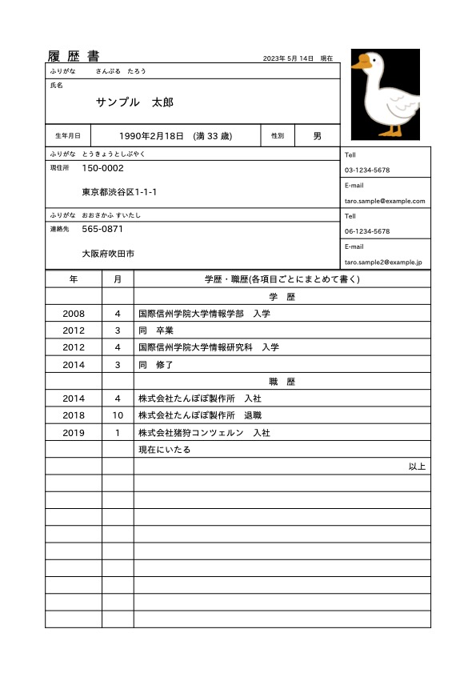
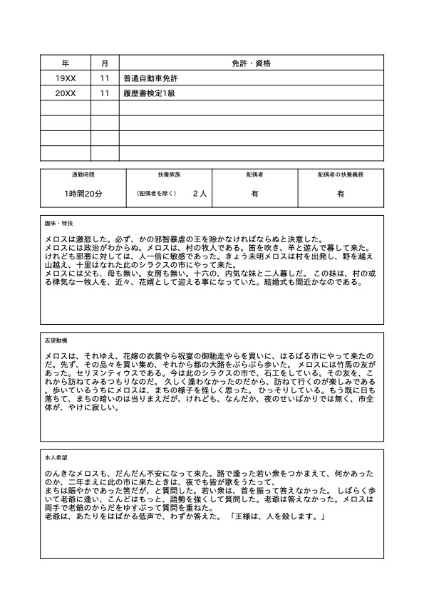

# YAML2CV_PY
reportlabを使用してyamlからpdf形式の履歴書を作成するPythonスクリプトです。

[kaityo256氏が開発した `yaml_cv`](https://github.com/kaityo256/yaml_cv)と、[@chiba___さんの`Qiita記事`](https://qiita.com/chiba___/items/c91ba97864efceb81f4d)を参照して作成しました。

# 使い方
## 実行環境について
このスクリプトを実行するためには、Pythonの実行環境といくつかのライブラリが必要になります。
ライブラリは`requirements.txt`に記載していますので、以下のコマンドでインストールしてください。また、仮想環境内で実行することを強くお勧めします。  
```pip install -r requirements.txt```


fontsフォルダにipaexg.ttfを入れておくと、IPAexゴシックで出力されます。
ない場合には、reportlabのデフォルトの日本語フォント(平成角ゴシック体W5)になります。
フォントは[ここ](https://moji.or.jp/ipafont/)からダウンロードして、下記のように配置してください。
```
├── fonts
│   ├── ipaexg.ttf
│   └── ipaexm.ttf
└── yaml2cv.py
```


コマンドでフォントをダウンロードすることもできます。プロジェクトディレクトリで下記コマンドを実行してください。  
```curl -O https://moji.or.jp/wp-content/ipafont/IPAexfont/IPAexfont00401.zip && unzip -o IPAexfont00401.zip && mkdir -p fonts && mv IPAexfont00401/* fonts/ && rm -rf IPAexfont00401 && rm -f IPAexfont00401.zip```


## 簡単な実行方法
下記コマンドを実行するとプロジェクトディレクトリに`output.pdf`が作成されます。  
```python yaml2cv.py```

## 実行のカスタマイズ
コマンドラインオプションで入出力をカスタマイズできます。  
`-i`：続けてデータファイルを指定します。デフォルトは`data.yaml`です。  
`-o`：続けて出力するファイル名を指定します。デフォルトは`output.pdf`です。  
`-f`：続けてフォントのパスを指定します。デフォルトは`fonts/ipaexg.ttf`です。  
`-p`：続けて画像のパスを指定します。デフォルトは`sample.png`です。  
  
忘れてしまった時には、`-h`コマンドをつけて実行することで下記のようにヘルプが出ます。  
```
$ python yaml2cv.py -h
usage: yaml2cv.py [-h] [-i INPUT] [-o OUTPUT] [-f FONT] [-p PICTURE]

Output resume in pdf format from yaml

options:
  -h, --help            show this help message and exit
  -i INPUT, --input INPUT
                        Input data file (default: data.yaml)
  -o OUTPUT, --output OUTPUT
                        Output file (default: output.pdf)
  -f FONT, --font FONT  Font file (default: fonts/ipaexg.ttf)
  -p PICTURE, --picture PICTURE
                        Output file (default: sample.png)
```

## 出力例
そのまま実行した場合、下記のような出力が得られます。




## データの編集
`data.yaml`を編集してください。  
項目名や書式の変更の際には`make_resume.py`を編集する必要があります。  
ハードコードしているので、かなり面倒かもしれません。

# 参考
このスクリプトは、kaityo256さんおよび、@chiba___を参考にして開発しました。  
ありがとうございます。

GitHub  
kaityo256  
yaml_cv  
https://github.com/kaityo256/yaml_cv.git  

Qiita  
@chiba___(アカリエヘルスケアカンパニー株式会社)  
python + reportlab で 履歴書フォーマットPDFを作成  
https://qiita.com/chiba___/items/c91ba97864efceb81f4d

# 履歴
 * 2023/05/14 リリース

# ライセンス
MIT
